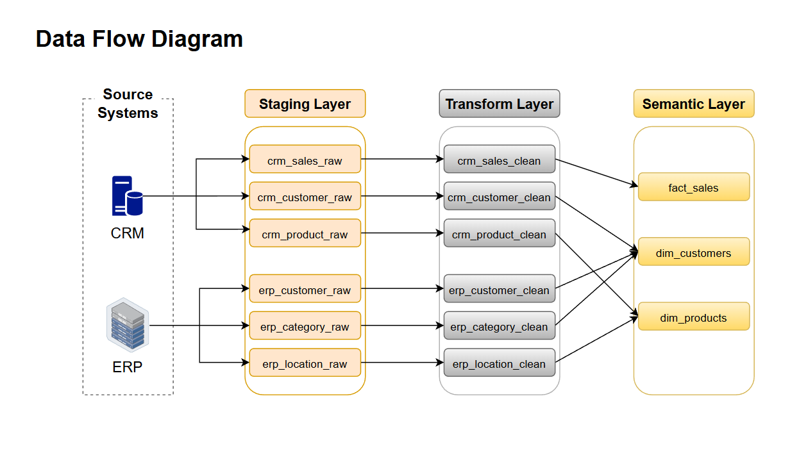
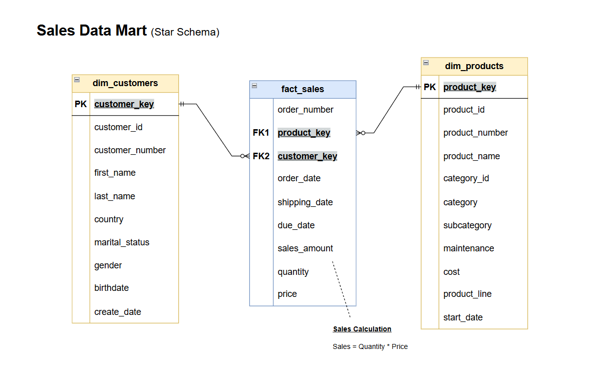
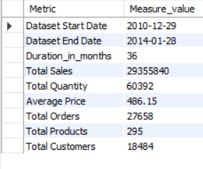
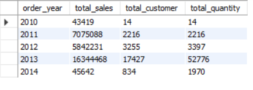
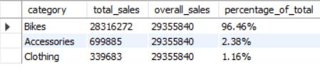
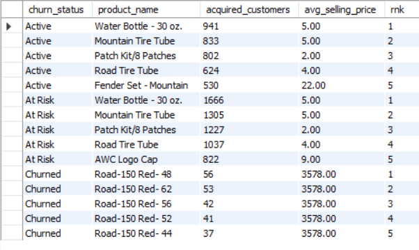

<h1>📊 Sales Analytics & Customer Intelligence — End-to-End SQL Project</h1>
<hr/>

<h2 id="toc">📌 Table of Contents</h2>
<ul>
  <li><a href="#overview"> Project Overview</a></li>
  <li><a href="#problem"> Problem Statement</a></li>
  <li><a href="#repository"> Repository Structure</a></li>
  <li><a href="#dataset"> Dataset & Source Systems</a></li>
  <li><a href="#modeling"> Data Modelling & Architecture</a></li>
  <li><a href="#eda"> Exploratory Data Analysis (EDA)</a></li>
  <li><a href="#insights"> Key Insights</a></li>
  <li><a href="#recommendations"> Business Recommendations</a></li>
  <li><a href="#tools"> Tools & Skills Demonstrated</a></li>
</ul>

<hr>

<h2 id="overview">1️⃣ Project Overview</h2>
<p>
A comprehensive end-to-end sales analytics project that transforms raw transactional data from
CRM and ERP systems into actionable business insights using SQL.
</p>
<p>
A star-schema data warehouse was designed, cleaned, and queried to build analytical views,
following real-world data warehousing and analytics best practices.
</p>

<hr/>

<h2 id="problem">2️⃣ Problem Statement</h2>
<p>The business faces challenges in:</p>
<ul>
  <li>Understanding revenue concentration and category dependence</li>
  <li>Identifying high-value customers vs one-time buyers</li>
  <li>Detecting churn risk early using Recency & Frequency</li>
  <li>Evaluating product lifecycle and YoY performance</li>
  <li>Knowing which products drive acquisition vs long-term value</li>
  <li>Aligning marketing, retention, and product strategy with data</li>
</ul>

<p><strong>🎯This project answers:</strong><br/>
<em>Where is revenue coming from, who is generating it, what is driving churn, and how can growth be made sustainable?</em>
</p>

<hr/>

<h2 id="repo-structure">3️⃣ Repository Structure</h2>

<pre>
📁SQL_Sales_Analytics_End_to_End_Project/
│
├── datasets/
│   ├── raw_crm/
│   └── raw_erp/
│
├── Scripts/
│   ├── 01_Clean_Layer_ddl.sql
│   ├── 02_Data_Cleaning_etl.sql
│   ├── 03_Modelling_Views.sql
│   └── 04_EDA_insights.sql
│
├── diagrams/
│   ├── query_results/
│   ├── Data_flow.png
│   └── Star_schema.png
│
├── LICENSE
└── README.md
</pre>


<hr/>

<h2 id="dataset">4️⃣ Dataset & Source Systems</h2>


<ul>
  <li><strong>CRM:</strong> Customer demographics, products, sales</li>
  <li><strong>ERP:</strong> Customer, location, category</li>
	
  <p><strong>Granularity:</strong> Order-line level</p>
</ul>

<p>
Raw data was cleaned into 6 tables and modeled into 3 analytical views.
</p>

<hr/>

<h2 id="modeling">5️⃣ Data Modelling & Architecture</h2>

<h3>5.1 Clean Layer DDL</h3>
<p><a href="Scripts/01_Clean_Layer_ddl.sql">View SQL</a></p>

<h3>5.2 Data Cleaning ETL</h3>
<p><a href="Scripts/02_Data_Cleaning_etl.sql">View SQL</a></p>
<ul>
  <li>Standardized date formats and missing values</li>
  <li>Removed duplicates using validation checks</li>
  <li>Normalized gender & marital status</li>
  <li>Derived sales amount and price</li>
  <li>Ensured consistent identifiers</li>
</ul>

<h3>5.3 Analytical Views</h3>
<p><a href="Scripts/03_Modelling_views.sql">View SQL</a></p>
<ul>
  <li>Star schema design</li>
  <li>Fact table built using surrogate keys</li>
  <li>Entity relationships enforced</li>
  <li>Reusable semantic layer</li>
</ul>



<hr/>

<h2 id="eda">6️⃣ Exploratory Data Analysis (EDA)</h2>
<p><a href="Scripts/04_EDA_insights.sql">View Full SQL</a></p>

<hr/>

<h2 id="eda-highlights">📌 EDA Question Highlights</h2>

<h3>Q1. Generate a report that summarizes key business metrics (sales, orders, customers, products).</h3>

```sql
SELECT 'Dataset Start Date' AS Metric, MIN(order_date) FROM fact_sales
UNION ALL
SELECT 'Dataset End Date', MAX(order_date) FROM fact_sales
UNION ALL
SELECT 'Duration_in_months', TIMESTAMPDIFF(MONTH, MIN(order_date), MAX(order_date)) FROM fact_sales
UNION ALL
SELECT 'Total Sales', SUM(sales_amount) FROM fact_sales
UNION ALL
SELECT 'Total Quantity', SUM(quantity) FROM fact_sales
UNION ALL
SELECT 'Average Price', ROUND(AVG(price),2) FROM fact_sales
UNION ALL
SELECT 'Total Orders', COUNT(DISTINCT order_number) FROM fact_sales
UNION ALL
SELECT 'Total Products', COUNT(DISTINCT product_key) FROM dim_products
UNION ALL
SELECT 'Total Customers', COUNT(*) FROM dim_customers;
```
<p>Result:</p>

<p><strong>Insight:</strong> <em>Dataset spans 36 months with ~18.5K customers and €29.3M in sales.</em></p>

<hr/>

<h3>Q2. How do sales perform over time at yearly and monthly levels? </h3>

```sql
SELECT
	YEAR(order_date) AS order_year,
	SUM(sales_amount) AS total_sales,
	COUNT(DISTINCT customer_key) AS total_customer,
	SUM(quantity) AS total_quantity
FROM fact_sales 
WHERE order_date IS NOT NULL
GROUP BY YEAR(order_date)
ORDER BY YEAR(order_date);
```
<p>Result:</p>

<p><strong>Insight:</strong> <em>2013 peaks; 2014 decline due to early data cutoff. December shows holiday seasonality while
February is the weakest.</em></p>

<hr/>

<h3>Q3. Which product categories contribute the most to overall revenue? </h3>

```sql
WITH category_sales AS (
  SELECT 
  	p.category,
      SUM(f.sales_amount) AS total_sales
  FROM fact_sales f
  LEFT JOIN dim_products p
  	ON f.product_key= p.product_key
  GROUP BY p.category)
SELECT
    category,
    total_sales,
    SUM(total_sales) OVER() AS overall_sales,
    CONCAT(ROUND((total_sales/SUM(total_sales) OVER())*100,2),'%'
  ) AS percentage_of_total
FROM category_sales
ORDER BY total_sales DESC;
```
<p>Result:</p>

<p><strong>Insight:</strong> <em>Category "Bikes" dominates revenue 96.46% (~28.3M EUR). This creates both opportunity (focus on best-sellers) and risk (high category concentration).<em></p>

<hr/>

<h3>Q4. Analyse Churn pattern Using Combined RFM (Recency–Frequency–Monetary) behaviour.</h3>

```sql
WITH 
churn_base AS (
	SELECT 
		CASE
			WHEN lifespan_in_months < 3 THEN 'New'
			WHEN recency_in_months > 12 THEN 'Churned'
			WHEN recency_in_months BETWEEN 4 AND 12 THEN 'At Risk'
			ELSE 'Active'
		END AS churn_status,
        CASE
			WHEN total_orders=1 THEN 'One-time'
            WHEN total_orders BETWEEN 2 AND 3 THEN 'Occasional'
            ELSE 'Loyal'
		END AS frequency_status,
		customer_key,
		total_sales,
		total_orders,
		average_order_value,
		average_monthly_spend,
		recency_in_months
	FROM report_customers
    )
	SELECT
		churn_status,
        frequency_status,
        COUNT(DISTINCT customer_key) AS total_customer,
		SUM(total_sales) AS total_revenue,
		SUM(total_orders) AS total_orders,
		ROUND(AVG(average_order_value), 2) AS avg_order_value,
		ROUND(AVG(average_monthly_spend), 2) AS avg_monthly_spend,
		ROUND(AVG(recency_in_months), 2) AS avg_recency
	FROM churn_base
	GROUP BY churn_status, frequency_status
	ORDER BY total_customer DESC;
```
<p>Result:</p>

<p><strong>Insight:</strong><em> Churn is extremely low. Most customers are New + One-Time buyers, while the At-Risk + Occasional segment 
contributes the highest revenue, indicating strong spenders slipping away. Active customers remain the most stable group, but loyal customers are rare — highlighting retention as the biggest opportunity area.</em>em></p>

<hr/>

<h3>Q5. Which 5 products drive initial customer acquisition across Churn states (Active, At risk, Churned)? </h3>

```sql
WITH customer_churn AS (
    SELECT
        customer_key,
        CASE
            WHEN TIMESTAMPDIFF(MONTH, MAX(order_date), (SELECT MAX(order_date) FROM fact_sales)) > 12 THEN 'Churned'
            WHEN TIMESTAMPDIFF(MONTH, MAX(order_date), (SELECT MAX(order_date) FROM fact_sales)) BETWEEN 4 AND 12 THEN 'At Risk'
            ELSE 'Active'
        END AS churn_status
    FROM fact_sales
    GROUP BY customer_key  
),

  first_purchase AS (
      SELECT
          customer_key,
          MIN(order_date) AS first_order_date
      FROM fact_sales
      GROUP BY customer_key
),

  acquisition_products AS (
      SELECT
          c.churn_status,
          f.product_key,
          COUNT(DISTINCT f.customer_key) AS acquired_customers,
          AVG(f.sales_amount / NULLIF(f.quantity,0)) AS avg_selling_price
      FROM fact_sales f
      JOIN first_purchase fp
          ON f.customer_key = fp.customer_key
         AND f.order_date = fp.first_order_date
      JOIN customer_churn c
          ON f.customer_key = c.customer_key
      GROUP BY c.churn_status, f.product_key
),

  ranked_products AS (
      SELECT
          churn_status,
          p.product_name,
          acquired_customers,
          ROUND(avg_selling_price,2) AS avg_selling_price,
          RANK() OVER (
              PARTITION BY churn_status
              ORDER BY acquired_customers DESC
          ) AS rnk
      FROM acquisition_products ap
      JOIN dim_products p
          ON ap.product_key = p.product_key
)
SELECT *
FROM ranked_products
WHERE rnk <= 5
ORDER BY churn_status, rnk;
```
<p>Result:</p>

<p><strong>Insight:</strong> <em>Classic “entry funnel” behavior, Low-cost accessories (e.g., Water Bottle – 30 oz., Tire Tubes, Patch Kits) are the strongest acquisition drivers for Active and At-Risk customers but fail to retain them long-term, while high-priced bikes primarily attract one-time buyers who quickly churn.</em>
</p>

<hr/>

<h2 id="insights">7️⃣ Key Insights</h2>

<h3>Revenue & Products</h3>
<ul>
  <li>🚲 Bikes contribute ~96% of total revenue, indicating extreme category dependence on high-ticket products.</li>
  <li>📉 Accessories and Apparel drive acquisition but contribute marginal revenue despite high product counts.</li>
  <li>📊 2013 was the strongest year across nearly all products; 2014 shows a broad decline, indicating market contraction rather than product-specific failure.</li>
</ul>

<h3>Customers</h3>
<ul>
  <li>👥 Revenue is highly concentrated: ~85% of customers are New buyers, but only ~9% become VIPs.</li>
  <li>💎 VIPs generate revenue comparable to all New buyers</li>
  <li>🔁 62% one-time buyers</li>
</ul>

<h3>Churn & Retention</h3>
<ul>
  <li>⚠️ At-Risk customers generate the highest total revenue, but show declining engagement — making them the top win-back opportunity.</li>
  <li>🔒 Active customers are stable but few</li>
  <li>🎯 Churn is behavioral, not value-driven</li>
</ul>

<h3>Acquisition & Cohorts</h3>
<ul>
  <li>📈 Customer acquisition surged in 2012–2013, but retention did not scale.</li>
  <li>🔄 Seasonal retention recovery (Jul, Aug, Dec)</li>
  <li>🧩 Hybrid customer base: one-time mass buyers + loyal enthusiasts</li>
</ul>

<h3>Product–Customer Interaction</h3>
<ul>
  <li>🧲 Low-cost accessories dominate customer acquisition, but conversion into long-term value is weak.</li>
  <li>💰 High-priced bikes are mostly one-time purchases but drive revenue — highlighting a cross-sell opportunity gap.</li>
  <li>🔄 Repeat purchases are rare across most products.</li>
</ul>

<hr/>

<h2 id="recommendations">8️⃣ Business Recommendations</h2>
<ul>
  <li>Prioritize win-back campaigns for At-Risk high-value customers</li>
  <li>Build structured upsell paths from low-cost entry products</li>
  <li>Improve onboarding for new customers</li>
  <li>Rationalize low-performing products to improve margins</li>
  <li>Invest in VIP & loyalty programs</li>
</ul>

<hr/>

<h2 id="skills">9️⃣ Tools & Skills Demonstrated</h2>
<ul>
  <li>SQL (mySQL)</li>
  <li>CTEs, Window Functions, Complex joins, CASE, Aggregations</li>
  <li>Data Warehousing & Star Schema Design</li>
  <li>Time-Series Analysis</li>
  <li>RFM & Cohort Analysis</li>
  <li>Business-Focused EDA</li>
  <li>KPI & Metric Engineering</li>
</ul>

<hr>

<p><b>⭐ If you like this project, feel free to star the repository!</b></p>
<p>
Learning reference: <a href="https://www.youtube.com/@DataWithBaraa" target="_blank">
Data with Baraa</a>
</p>

